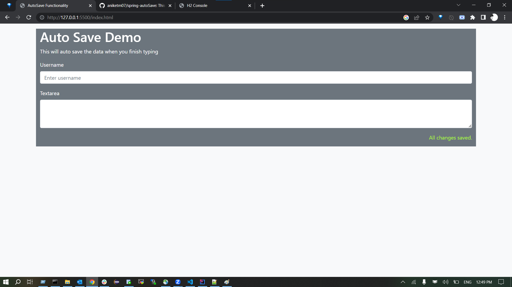
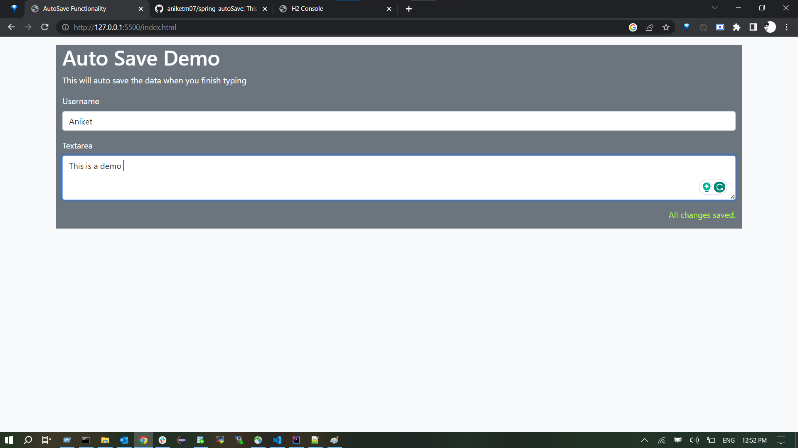
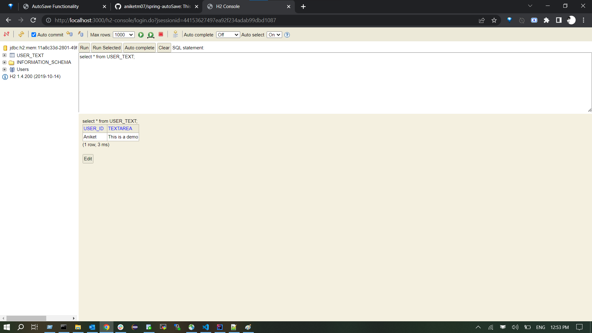
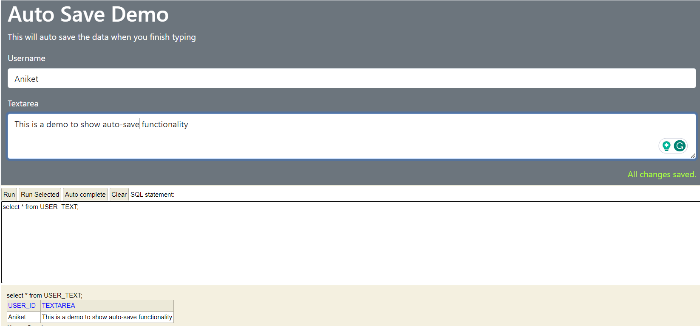

# spring-autoSave
This is a springboot project to auto save the form data into the h2Database

# Screenshots

- Webpage

- Add username and text

- Gets auto updated in Database once you finish typing

- Updated values

